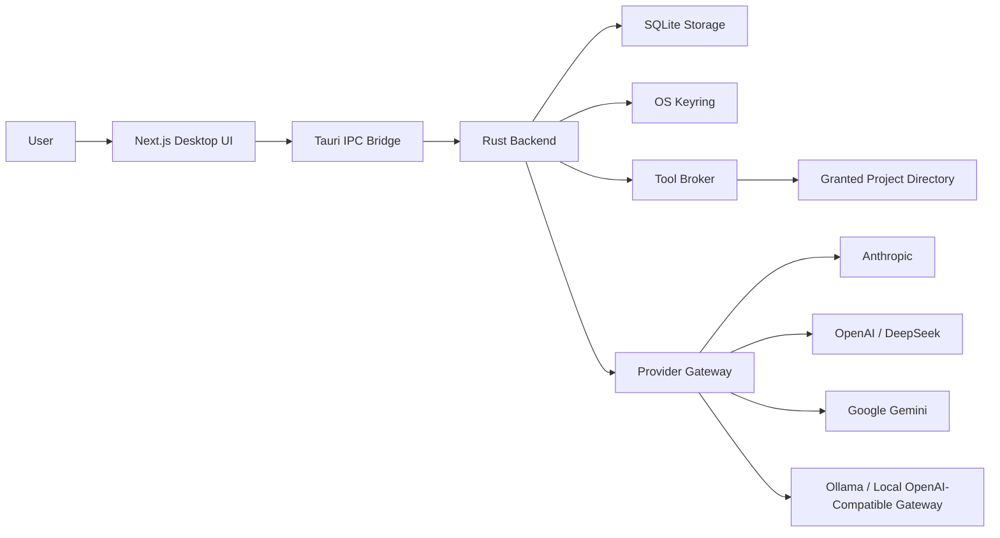
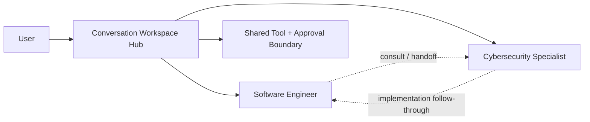
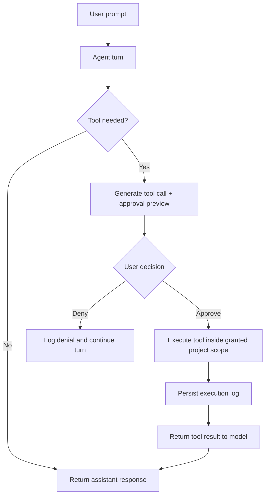

# Pantheon Forge

Pantheon Forge is a local-first desktop AI agent workspace built with
Next.js, Tauri, and Rust. It provides a command-deck interface for working
with specialized agents, switching between LLM providers, and approving
project-scoped tool execution before any file or command action runs.

This repository is positioned as an engineering project first: the most
interesting part of Pantheon Forge is not a generic chat interface, but the
combination of a desktop-native shell, a Rust orchestration layer, explicit
agent boundaries, and a safety-conscious approval workflow for tool use.

## Why This Project Exists

Most AI workspaces are either browser-first, cloud-dependent, or vague about
what an agent is allowed to do. Pantheon Forge explores a different model:

- `Local-first`: conversations, settings, and project context stay on the machine
- `Explicit agents`: specialist personas are inspectable and data-driven
- `Provider-flexible`: Anthropic, OpenAI, DeepSeek, Google Gemini, and local gateways are supported
- `Approval-gated`: tool execution is visible and user-controlled
- `Desktop-native`: the experience is built around a desktop shell rather than a browser dashboard

## What Is Implemented Today

Pantheon Forge currently ships three core desktop surfaces:

- `Launchpad`: agent selection, readiness overview, and quick return to active work
- `Chat Workspace`: full conversation surface with streaming output, provider routing, and inline tool activity
- `Provider Settings`: provider configuration, project access grants, and tool execution control/history

Current capabilities:

- `Two bundled specialist agents`: Software Engineer and Cybersecurity Specialist
- `Provider-backed chat`: Anthropic, OpenAI, DeepSeek, Google Gemini, and Ollama/OpenAI-compatible local gateways
- `Project-scoped tools`: read/search/write file actions plus curated command execution
- `Per-call manual approval`: every tool request is previewed before execution
- `Persistent local state`: SQLite for conversations/settings and OS keyring storage for credentials
- `Desktop command shell`: Next.js frontend inside a Tauri application with a Rust backend

## Architecture

Pantheon Forge uses a split architecture: React/Next.js owns the UI, Tauri
provides the native shell and IPC bridge, and Rust owns provider routing,
local persistence, and tool execution.



### Agent Model

The product is designed around a hub-and-spoke mental model: the user works in
one workspace, and specialist agents plug into that workspace rather than
operating as opaque black boxes.



### Tool Approval Flow

Tool execution is intentionally explicit. Models can request actions, but the
user remains in control of execution.



## Safety Model

Pantheon Forge is intentionally conservative about local execution:

- credentials are stored in the OS keyring rather than in SQLite
- project access is granted per directory, not globally
- tools are scoped to the attached project grant
- tool approvals are explicit and visible in the UI
- execution history is persisted for auditability
- command execution is curated rather than arbitrary shell access

## Technical Stack

- `Frontend`: Next.js 16, React 19, TypeScript, Tailwind CSS v4, Zustand
- `Desktop shell`: Tauri 2
- `Backend`: Rust, async IPC commands, provider adapters, tool broker
- `Storage`: SQLite
- `Credentials`: OS keyring
- `Workspace tooling`: pnpm workspaces + Turbo

## Project Status

Pantheon Forge is demo-ready as an engineering prototype. The core desktop
workflow, provider layer, local persistence model, and approval-gated tool
system are implemented and working.

Near-term work is focused on:

- specialist-only cybersecurity tools
- further documentation and release polish
- deeper multi-agent collaboration beyond the current specialist routing model

## Repository Layout

```text
ultron/
├── apps/
│   └── desktop/                 # Next.js + Tauri desktop app
│       ├── app/                 # App Router routes
│       ├── components/          # Chat, shell, settings, and project UI
│       ├── lib/                 # Tauri bridge and frontend helpers
│       ├── stores/              # Zustand state stores
│       └── src-tauri/           # Rust backend, IPC, migrations, capabilities
├── packages/
│   ├── agent-registry/          # Agent definitions and loaders
│   ├── agent-types/             # Shared TypeScript contracts
│   ├── crypto/                  # Reserved shared crypto helpers
│   └── ui/                      # Shared UI primitives
├── docs/                        # Project brief and diagram sources
├── tasks/                       # Internal project tracking notes
└── ultron.md                    # Deeper architecture and roadmap document
```

## Running The Project

### Prerequisites

- Node.js `20+`
- `pnpm` `10.x`
- Rust toolchain
- Tauri desktop prerequisites for your operating system

### Install

```bash
pnpm install
```

### Develop

From the repo root:

```bash
pnpm dev
pnpm lint
pnpm build
```

From the desktop app:

```bash
cd apps/desktop
pnpm dev
pnpm tauri:dev
```

## Additional Documentation

- [Project brief](./docs/project-brief.md)
- [Architecture and roadmap](./ultron.md)

## License

MIT
