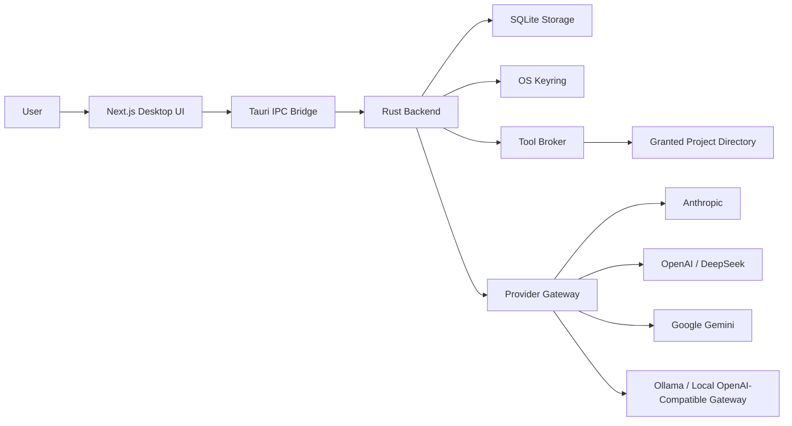
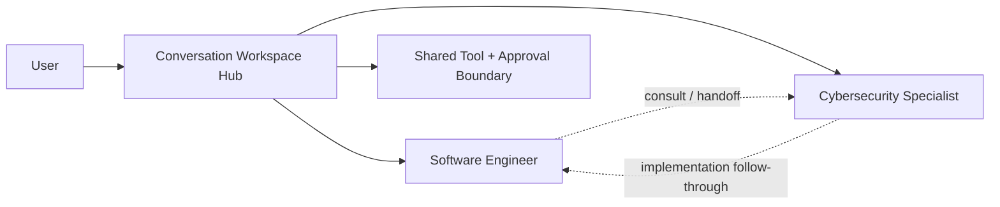
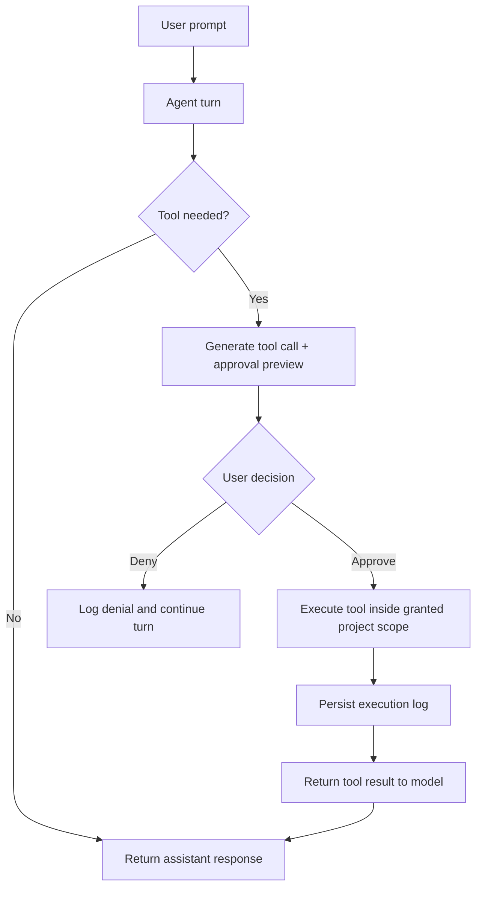

# Pantheon Forge Project Brief

Pantheon Forge is a local-first desktop AI agent workspace designed to
explore a safer, more explicit model for human-directed AI assistance. The
project combines a Next.js desktop interface, a Tauri shell, and a Rust
backend to support specialist agents, multiple LLM providers, project-scoped
tool execution, and mandatory approval for every tool call.

## Project Overview

The project investigates a desktop-native alternative to cloud-heavy AI
workspaces. Instead of hiding execution inside an opaque browser product,
Pantheon Forge keeps conversation history, provider credentials, and tool
execution close to the user’s machine and makes permission boundaries visible
inside the interface.

## Research Motivation

Pantheon Forge is motivated by a practical research question: what should an
AI agent workspace look like when the goal is not maximum autonomy, but
useful human-directed agency with explicit safety boundaries? Many agent
systems focus on capability demonstrations while leaving execution policy,
local control, and operator oversight under-specified.

This project explores a different framing. It treats the desktop as an
experimental environment for studying specialist-agent interaction patterns,
tool-use transparency, and approval as part of the interaction loop rather
than as an external safety layer.

## Design Goals

- Build a local-first desktop workspace for AI-assisted technical work
- Keep agent personas explicit, inspectable, and data-driven
- Support multiple model providers behind one shared interaction model
- Require user approval before tools read files, modify code, or run commands
- Separate interface concerns from execution concerns through a Rust backend

## High-Level Architecture

Pantheon Forge uses a split architecture: the frontend owns presentation and
interaction, while the Rust backend owns provider access, local persistence,
and tool execution.

Source: [high-level-architecture.mmd](./diagrams/high-level-architecture.mmd)

## Hub-Spoke Agent Model

The workspace is intentionally centered around a single conversation hub. The
user works through one shared surface, while specialist agents act as spokes
that can be selected, consulted, or handed work in a controlled way.

This model is also research-relevant because it makes delegation legible.
Instead of hiding multi-agent behavior inside an opaque orchestration graph,
the architecture keeps the user at the center of a workspace where specialist
roles and future handoff behavior can be examined explicitly.

Source: [hub-spoke-delegation.mmd](./diagrams/hub-spoke-delegation.mmd)

## Approval-Gated Tool Execution

Tool use is explicit rather than implicit. A model can request an action, but
execution only happens after the user sees a preview and approves the request.

From a research perspective, this creates a clean human-in-the-loop boundary.
The system can be evaluated not only on task completion, but also on whether
it requests the right actions, presents intelligible previews, and adapts well
when a user denies or redirects a proposed tool call.

Source: [tool-approval-workflow.mmd](./diagrams/tool-approval-workflow.mmd)

## Current Implementation Status

Pantheon Forge currently includes:

- a desktop shell built with Tauri 2
- a Next.js/React interface for launchpad, chat, and settings
- a Rust backend for provider orchestration and tool execution
- SQLite-backed persistence for conversations and settings
- OS-keyring storage for provider credentials
- support for Anthropic, OpenAI, DeepSeek, Google Gemini, and Ollama-compatible local gateways
- approval-gated tools for reading files, searching files, writing files, and curated command execution

## AI/Agent Research Relevance

The project is useful as a research-oriented engineering artifact because it
brings together several live questions in agent systems:

- how human oversight should be integrated into agent tooling
- how specialist agents should be represented and bounded
- how provider differences affect tool-enabled agent behavior
- how trust is shaped by visible approval, logging, and local control

## Why This Project Is Technically Meaningful

Pantheon Forge is interesting as an engineering project because it combines
multiple concerns that are often treated separately: desktop UX, local system
integration, provider abstraction, safety controls, and explicit tool
approval. It is designed not just as a chat interface, but as a structured
runtime for human-controlled agent work.

The repository demonstrates:

- a practical Next.js + Tauri + Rust architecture
- a local-first credential and persistence model
- an approval-oriented tool broker instead of unrestricted automation
- a shared interaction model across both cloud and local LLM providers

## Current Limitations

Pantheon Forge is intentionally scoped. It currently prioritizes safe,
transparent, single-user desktop workflows over fully autonomous breadth.
Multi-agent delegation is part of the architectural direction, but not yet a
fully realized runtime behavior, and specialist tooling is still concentrated
around core file and command operations.

## Future Improvements and Research Directions

The next meaningful directions for the project are both practical and
research-oriented:

- expand specialist toolsets, especially for cybersecurity analysis
- study delegation and handoff protocols between specialist agents
- evaluate approval UX quality, including preview clarity and denial recovery
- compare local and cloud providers under the same tool-enabled task model
- define metrics for bounded agency, such as permission friction, action usefulness, and operator confidence

## Exported Brief

The application-ready PDF export lives at [project-brief.pdf](./project-brief.pdf).
